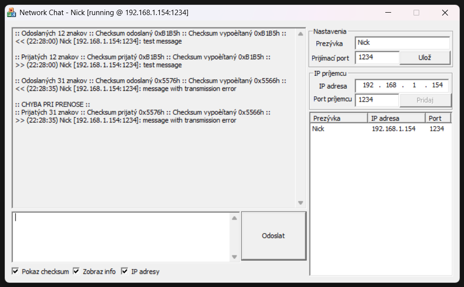

# Network Chat

A peer-to-peer UDP chat application built with MFC (Microsoft Foundation Classes) and C++ using Winsock.

## Disclaimer

This project was originally developed as part of the Computer Networks I course during the 2008/2009 summer semester at the Faculty of Informatics and Information Technologies, Slovak University of Technology (FIIT STU). The task description is available in [TaskDescription.md](TaskDescription.md).

After remaining untouched for nearly two decades, the repository was updated in 2026. The codebase was refactored and modernized using AI-assisted tools, specifically GitHub Copilot CLI (powered by Claude Opus 4.6), to improve code quality and resolve legacy bugs.

Note on Implementation: The primary objective of this project was to demonstrate a fundamental understanding of network encapsulation. While the original code may not reflect modern industry standards, it served as a functional educational proof-of-concept.

For those interested in the historical, unedited implementation, please refer to the [initial commit](https://github.com/mikebis/NetworkChat/tree/45eea6ea67e295ab505e771366c0d664663c767e).

Summary of AI review fixes (click to expand)

**Critical fixes:**
- Out-of-bounds array access in contact list storage
- Memory leak — receive buffer was never freed
- Header array overflow — reading past the end of a 12-byte array (corrected to 13)
- Null pointer crash in checksum calculation for odd-length data

**Bug fixes:**
- Byte encoding used `/255` instead of `/256` (6 locations)
- Buffer overflow when receiving max-size UDP packets
- Nickname comparison logic compared IP with nickname instead of nickname with nickname
- Clicking empty space in the contact list caused a crash
- Manually added contacts stored IP:port combined in one column, breaking click-to-fill
- No validation of minimum packet size before accessing header fields

**Robustness improvements:**
- Added error checking for Winsock initialization and hostname resolution
- Added error checking for socket creation
- Fixed format string vulnerabilities on both send and receive sides

**Cleanup:**
- Removed unused struct, dead commented-out code, and stale VS wizard markers
- Initialized previously uninitialized variables
- Removed `#pragma once` from source file
- Translated all Slovak comments, UI strings, and error messages to English

Additional files included:
- [TaskDescription.md](TaskDescription.md) - assignment description (translated from original Slovak to English using Copilot AI)
- [Documentation_SK.pdf](Documentation_SK.pdf) - original PDF documentation submitted with the project
- [Documentation_EN.pdf](Documentation_EN.pdf) - translated PDF documentation (using Copilot AI)
- [Documentation.md](Documentation.md) - translated documentation and formatted in MarkDown (using Copilot AI)

## Features

- **UDP messaging** — send and receive text messages over a local network
- **Custom protocol with headers** — 13-byte header containing message type, length, flags, message ID, packet number, total packets, and checksum
- **Message fragmentation** — large messages are automatically split into segments (max 1460 bytes per packet)
- **Checksum verification** — Internet-style one's complement checksum for data integrity validation
- **Contact list** — manage a list of peers (nickname, IP address, port); auto-updates nicknames on receive
- **Configurable** — set your nickname and listening port at runtime

## Screenshot

*(MFC dialog-based UI with a message log, message input, contact list, IP/port fields, and settings)*   

*Note: The screenshot shows Slovak labels as it was captured from the original pre-translation build.*

## Building

1. Open `networkchat.sln` in **Visual Studio 2008** (or a later version with backwards compatibility)
2. Select **Debug** or **Release** configuration
3. Build the solution (**F7** or *Build → Build Solution*)

### Requirements

- Visual Studio 2008+ with MFC support
- Windows SDK

## Protocol

Each UDP packet starts with a **13-byte header**:

| Byte(s) | Field            | Description                          |
|---------|------------------|--------------------------------------|
| 0       | Type             | `0` = nickname, `1` = message        |
| 1–2     | Length           | Payload length                       |
| 3       | Flags            | Bit 0: fragmentation flag            |
| 4–5     | Message ID       | Unique message identifier            |
| 6–7     | Packet Number    | Fragment index (0-based)             |
| 8–9     | Total Packets    | Total number of fragments            |
| 10–11   | Checksum         | One's complement checksum            |
| 12      | Reserved         | Reserved (zero)                      |

## Usage

1. Launch the application on two or more machines on the same network
2. Set your **nickname** and **listening port**, then click Save
3. Add a peer by entering their **IP address** and **port**, then click Add
4. Select a contact from the list, type a message, and click **Send**
5. Incoming messages appear in the log with timestamps and checksum verification results

## License

This project is licensed under the MIT License — see the [LICENSE](LICENSE) file for details.
